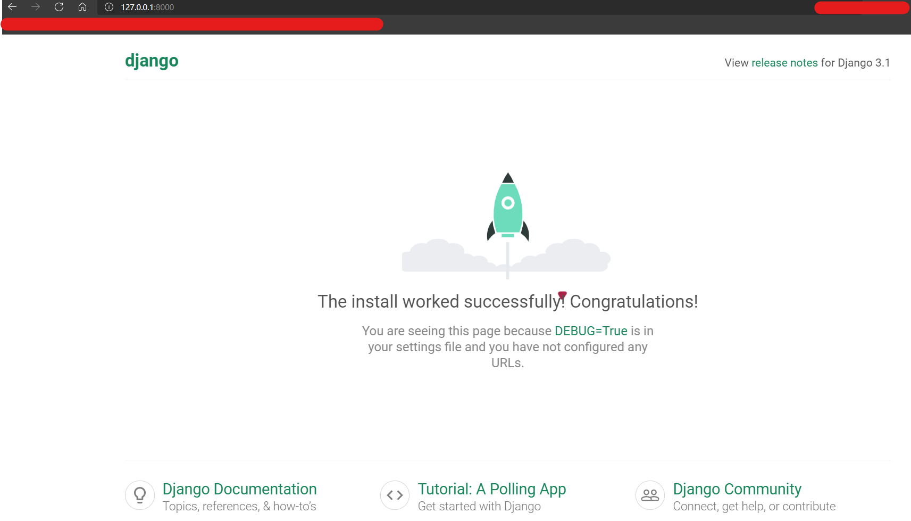

# file_server

LiChi

## Result Presentation

## Building steps

1. start project
    ```cmd
    django-admin startproject file_server
    ```
2. check default setting

    ```cmd
    python manage.py runserver
    ```

    

3. move your secret key in settings.py to secrets.py(if you need to public your code online like github, or skip)

    ```cmd
    # in the proj folder:
    cd file_server
    touch secrets.py # or create file in win
    ```

    ```py
    SECRET_KEY = 'd*************************************************'
    def getSecret():
        return SECRET_KEY
    ```

    add this secrets.py into gitignore